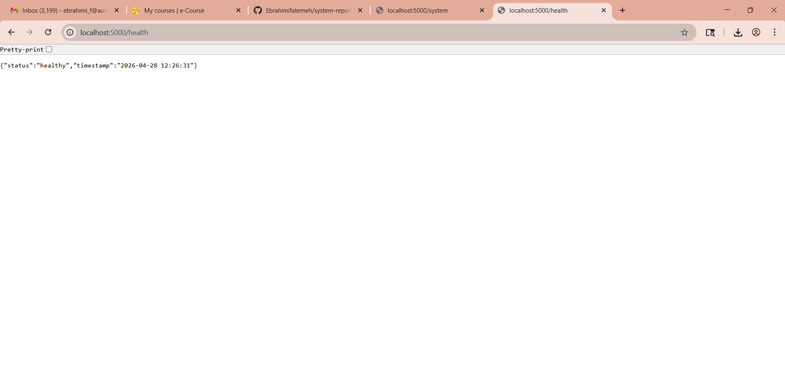
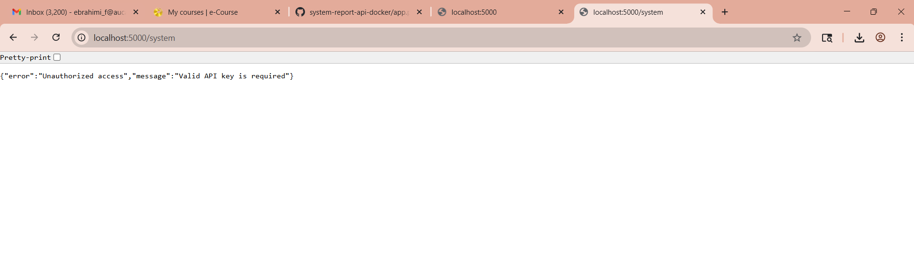
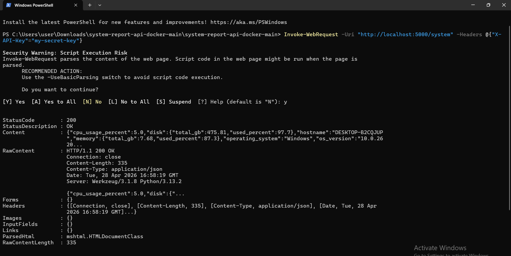
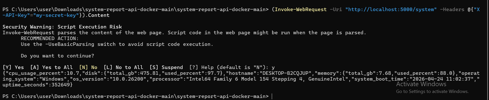
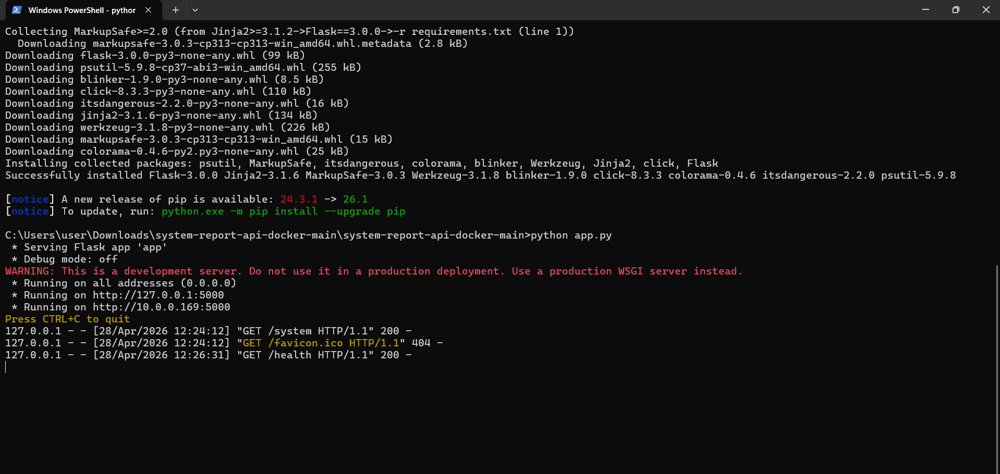
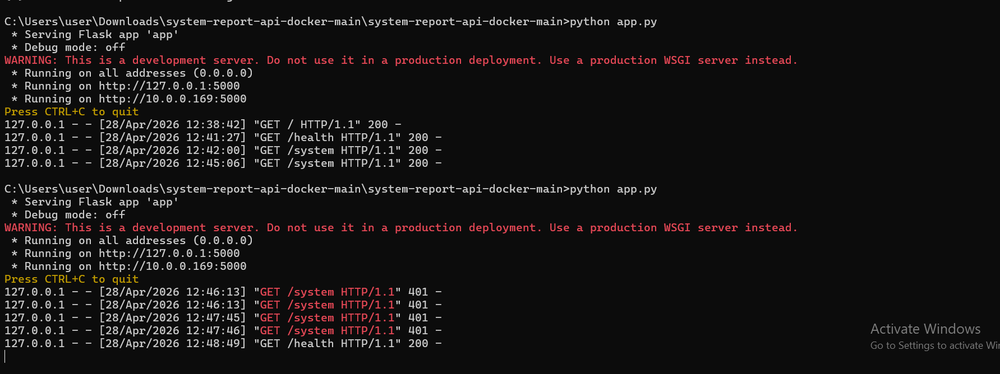

# Secure System Report API with Docker Deployment

**Student:** Fatemeh Ebrahimi
**Year:** 3rd Year Software Engineering Student, AUCA
**Course:** Information Security
**Instructor:** Gulzada Esenalieva
**Date:** Spring 2026

---

# Project Introduction

This project is a secure system monitoring API developed using Flask and psutil. The application provides real-time system information while protecting sensitive endpoints using API key authentication and Docker-based isolation.

The project demonstrates important Information Security concepts including:

* Access control
* Endpoint protection
* Secure API communication
* Containerized application isolation

---

# Table of Contents

1. Project Description
2. Problem This Project Solves
3. Architecture Overview
4. Technology Stack
5. Repository Structure
6. Security Logic and Design Decisions
7. Setup and Run Instructions
8. API Reference
9. Screenshots and Diagrams
10. Troubleshooting
11. Limitations and Production Notes
12. Future Improvements
13. Demo Video
14. Faculty Feedback
15. Conclusion
16. License

---

# Project Description

This project implements a REST API that provides real-time system monitoring information including:

* CPU usage
* Memory usage
* Disk usage
* Operating system information
* System uptime

The API is developed using Flask and psutil and is designed to run inside a Docker container for process isolation and portability.

Sensitive endpoints are protected using API key authentication to prevent unauthorized access to system-level information.

---

# Problem This Project Solves

Manual system monitoring is inefficient and can expose sensitive information if access is not properly restricted.

This project addresses:

* Unauthorized access risks
* Uncontrolled exposure of system information
* Lack of access control for monitoring APIs
* Insecure deployment environments

The project demonstrates how simple security mechanisms can significantly improve system protection.

---

# Architecture Overview

## System Flow

```mermaid


graph TD
    A[Client Browser / PowerShell] --> B[Flask API Server]
    B --> C[API Key Authentication]
    C --> D[psutil System Monitoring]
    D --> E[System Information]
    E --> F[Docker Container Isolation]
```

## Architecture Explanation

* The user sends a request to the Flask API
* Flask processes the request
* API key authentication validates access
* psutil retrieves real-time system information
* Docker isolates the application from the host system

Docker provides process-level isolation, reducing direct exposure to the host operating system and limiting resource access unless explicitly permitted.

---

# Technology Stack

## Backend

* Python 3
* Flask
* psutil

## Infrastructure

* Docker

## Security

* API Key Authentication
* Header-based request validation

---

# Repository Structure

```text
system-report-api-docker/
├── app.py
├── requirements.txt
├── Dockerfile
├── README.md
├── .gitignore
├── ScreenShots/
│   ├── health-api.png
│   ├── system-authorized.png
│   ├── system-unauthorized.png
│   ├── terminal-running.png
│   └── terminal-running2.png
└── presentation.pptx
```

---

# Security Logic and Design Decisions

## 1) Why API Key Authentication is used

The `/system` endpoint exposes sensitive system information such as:

* CPU usage
* Memory usage
* Disk information
* Operating system details

API key authentication restricts unauthorized users from accessing this information.

---

## 2) Why Request Headers are used

The API key is transmitted using the `X-API-Key` request header instead of URL parameters.

This is considered a security best practice because:

* URLs may be stored in browser history
* URLs may appear in server logs
* URLs may be exposed accidentally

Using headers reduces accidental information exposure.

---

## 3) Why Docker is important

Docker provides process isolation and ensures the application runs inside a controlled containerized environment.

Benefits include:

* Dependency isolation
* Reduced host exposure
* Improved portability
* Controlled runtime behavior

---

## 4) Why controlled error responses are important

Unauthorized requests return a controlled `401 Unauthorized` response.

This prevents exposure of internal application details and improves secure error handling.

---

# Setup and Run Instructions

## Prerequisites

* Python 3
* pip
* Optional: Docker Desktop

---

# Local Run

## Step 1 — Enter Project Folder

```bash
cd system-report-api-docker
```

## Step 2 — Install Dependencies

```bash
pip install -r requirements.txt
```

## Step 3 — Run Application

```bash
python app.py
```

## Step 4 — Open Browser

### Main Endpoint

```text
http://127.0.0.1:5000
```

### Health Endpoint

```text
http://127.0.0.1:5000/health
```

### Protected Endpoint

```text
http://127.0.0.1:5000/system
```

---

# Docker Run

## Build Docker Image

```bash
docker build -t system-report-api .
```

## Run Docker Container

```bash
docker run -p 5000:5000 system-report-api
```

---

# API Reference

## GET /

Returns API information and available endpoints.

---

## GET /health

Returns:

* API health status
* System status confirmation

---

## GET /system

Protected endpoint that returns:

* CPU usage
* Memory usage
* Disk usage
* Operating system information
* System uptime

Requires:

```text
X-API-Key
```

Example PowerShell Request:

```powershell
(Invoke-WebRequest -Uri "http://localhost:5000/system" -Headers @{"X-API-Key"="my-secret-key"}).Content
```

---

# Screenshots and Diagrams

## 1) API Health Check Endpoint

Shows that the API is running correctly.



---

## 2) Unauthorized Access

Demonstrates blocked access when no API key is provided.



### Security Note

The API returns a `401 Unauthorized` response for invalid requests.

---

## 3) Authorized Access

Demonstrates successful authenticated access using a valid API key.



---

## 4) Authorized Request Using PowerShell

Shows secure API access through request headers.



---

## 5) Flask Server Running

Shows the Flask application running locally.



---

## 6) Server Logs

Demonstrates successful and blocked requests.



---

# Troubleshooting

## python command not found

Use:

```bash
py app.py
```

---

## Unauthorized access

Ensure the correct API key is included in the request header.

---

## Port already in use

Stop the running application or change the application port.

---

# Limitations and Production Notes

* The current Flask server is development-oriented
* HTTPS/TLS should be enabled in production
* API keys should be stored using environment variables instead of hardcoded values
* Rate limiting should be implemented to reduce abuse risks
* Additional logging and monitoring should be added for production deployment

---

# Future Improvements

## HTTPS / TLS

Encrypt API traffic and credentials during transmission.

## Rate Limiting

Protect against excessive requests and potential DoS attacks.

## Environment Variables

Store sensitive credentials securely outside the source code.

## Production Deployment

Deploy using a production-grade WSGI server.

---

# Demo Video
[
(Add your video link here)](https://drive.google.com/file/d/1KJC21J694E7gcg7mns4fqK9PTXDisGVA/view?usp=drive_link) 

---

# Conclusion

This project demonstrates how a simple API can be enhanced using fundamental Information Security principles such as API key authentication and containerized deployment.

By restricting unauthorized access and isolating the runtime environment, the application reduces the risk of exposing sensitive system information.

The project combines:

* Secure API development
* Access control
* Docker isolation
* Real-time system monitoring

These concepts form the foundation for more advanced secure system architectures used in real-world applications.

---

# License

This project is intended for educational and demonstration purposes.
