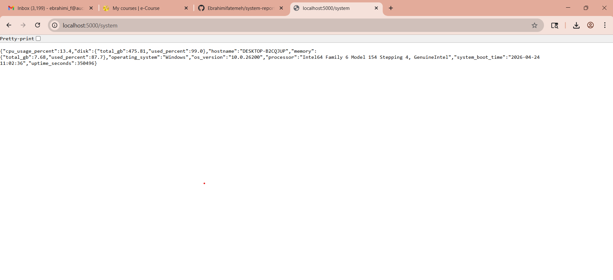

# System Report API with Docker Deployment

 #Project Topics
- **Intermediate:** System Report API  
- **Advanced:** Dockerized Web Server  

---

##  Project Description
This project is a System Report API that provides real-time information about a computer system such as CPU usage, memory usage, disk usage, operating system, and uptime.

The API is built using Flask and collects system data using psutil. It is designed to be deployed inside a Docker container, ensuring portability and isolation across different environments.

---

##  Problem & Motivation
Monitoring system resources manually is inefficient and time-consuming. There is a need for a simple and accessible way to retrieve system information programmatically.

This project solves that problem by providing a lightweight API that allows users to easily access system data through HTTP requests.

---

##  Architecture Overview
User → Flask API → psutil → System Data
↓
Docker Container

- Flask handles incoming HTTP requests  
- psutil collects system-level data  
- Docker provides an isolated runtime environment  

---

##  Security Considerations
This project includes basic security mechanisms:

- API Key Authentication  
  The /system endpoint requires a valid API key (X-API-Key) to access sensitive system data  

- Unauthorized Access Protection  
  Requests without a valid API key are blocked with a 401 Unauthorized response  

- Minimal Exposure  
  Only necessary system data is exposed  

- Containerization (Docker)  
  The application is designed to run inside a Docker container, improving isolation and reducing system-level risks  

---

##  Tech Stack
- Python  
- Flask  
- psutil  
- Docker  

---

## Features
- REST API for system monitoring  
- CPU, memory, disk usage reporting  
- Operating system and uptime information  
- Health check endpoint  
- API key protection for sensitive data  
- Docker-ready deployment  

---

## 🔗 API Endpoints

### Home
GET /

### Health Check
GET /health

### System Report (Protected)
GET /system  

Requires header:  
X-API-Key: my-secret-key  

---

## 🖥️ Screenshots

### System Report (Before Security)

### Unauthorized Access (Security Applied)

### Authorized Access (With API Key)

### Health Endpoint

### Terminal Running Application

---

## ▶️ How to Run Locally

pip install -r requirements.txt  
python app.py  

Then open in browser:  
http://localhost:5000  
http://localhost:5000/health  
http://localhost:5000/system  

---

## 🐳 Docker (Planned Deployment)

docker build -t system-report-api .  
docker run -p 5000:5000 system-report-api  

---

## 🎥 Demo Video
video link soon 

----

## Project Status
Completed ✔️ ( video in progress )
